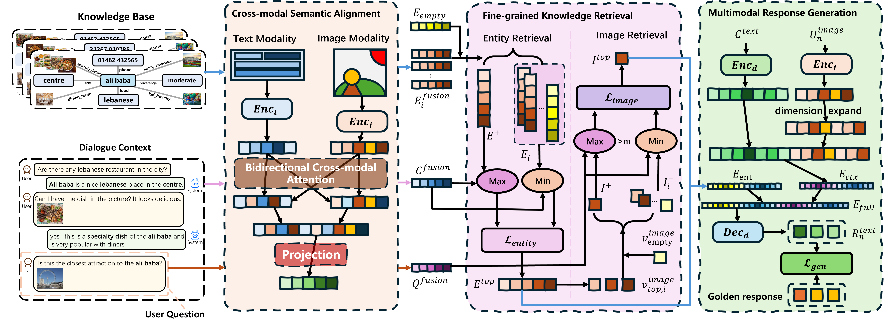

# 🌍 VIGOR: A Unified Vision-Guided Retrieval-Generation Framework for Multimodal Task-Oriented Dialogue

[ 🤗Huggingface ]

This repository contains the official implementation of our VIGOR framework and the accompanying multimodal TITOD dataset.

> coming soon

Overall, the VIGOR framework improves the understanding and modeling of vision-guided semantics, while the TITOD dataset provides a more challenging evaluation benchmark for image-text dialogue modeling. Together, they advance the development of task-oriented dialogue systems toward more realistic and higher-quality image-text interaction scenarios.

🔑 Key Contributions
1. **VIGOR Framework**: A unified vision-guided retrieval-generation framework named VIGOR is proposed, which tightly integrates knowledge retrieval and response generation, improving semantic alignment and response quality in image-dominant multi-turn task-oriented dialogues.
2. **Unified Optimization Strategy**: A triple-objective unified optimization strategy is introduced, enabling end-to-end collaborative training of text-image semantic understanding, knowledge retrieval, and response generation, thus overcoming the disjointed nature of traditional modular training approaches.
3. **TITOD Dataset**: A novel multimodal dataset named TITOD is constructed, which enhances the design of vision-driven dialogue scenarios and supports explore on image-centered task-oriented dialogue systems.

## 🧠 VIGOR Framework




## 📚 TITOD Dataset

TITOD dataset focusing on the restaurant reservation domain, whcih is the first multimodal TOD dataset that models multiple images as entity attributes and supports image-driven user questions.

### 🚀 Requirements

To run the evaluation and processing scripts:

```bash
pip install sacrebleu
```
